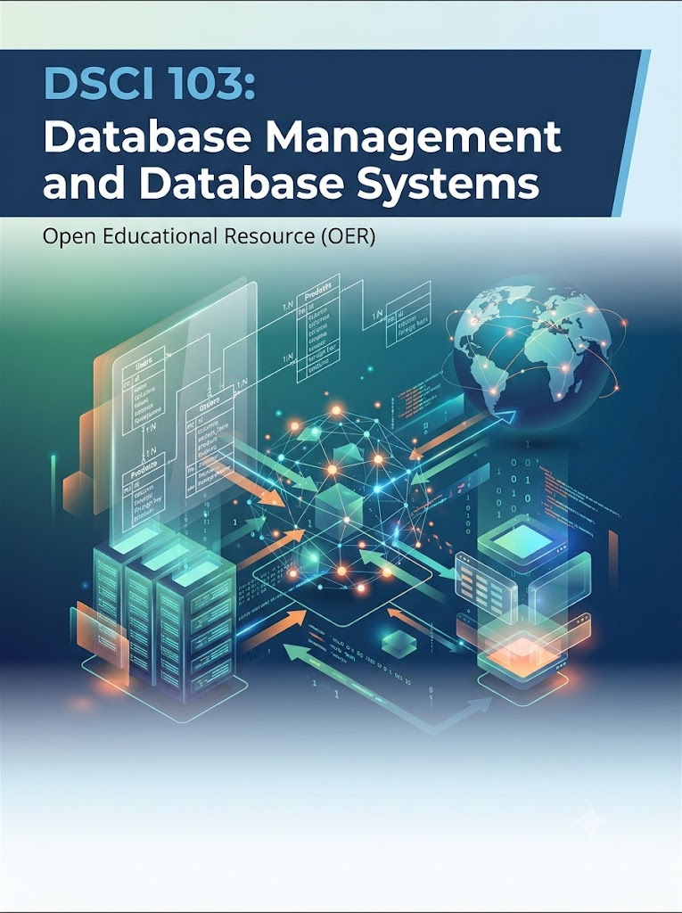

# dsci_103_database_management_and_database_systems_oer_v1

OER V1 for dsci_103_database_management_and_database_systems

This is a "living document" course, it will be updated as sections are delivered each fall semester and students provide feedback on what else is needed

Note: the other DSCI 103 repo is for the older version of the course using MySQL

This is a public repo for:

Students of Nick Schoeb enrolled at Harford Community College in DSCI 103 - Database Management and Database Systems.

This is primarily intended as another way to access code samples used in the course.

Note to students, this should make it easier to read and copy lecture code samples than the format provided in the LMS. I also intend to leave this up as long as possible so you can reference it long after you leave the course.

These are examples in PostgreSQL as part of a course focused on learning the fundamentals of relational databases. They are not necessarily intended to reflect any style of, era of, or even be definitive examples of PostgreSQL database programming. They are simply a generic use of a database used to teach basic ideas and skills needed across most dbms products.

These examples are currently geared towards using pagAdmin4. Most examples here are simple enough they can be easily adjusted to work with other tools.

This accompanies content on MOST OER related to a grant from HCC.

## Note to instructors: if you need access to exams or answers please contact me and verify as an instructor for materials.
